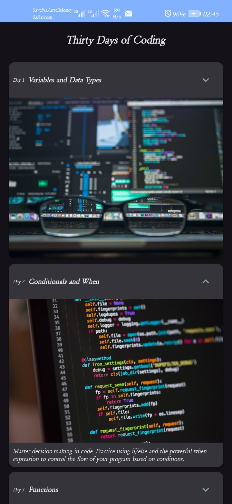

# 🗓️ Thirty Days of Coding

An Android app built with **Kotlin** and **Jetpack Compose** that guides users through 30 days of coding challenges — one topic per day.

## 📱 Screenshots

## 📱 Screenshots



## ✨ Features

- 30 daily coding challenge cards
- Expandable cards with smooth animations
- Material 3 theming with light and dark mode support
- Clean architecture with separated data, model, and UI layers

## 🛠️ Built With

- [Kotlin](https://kotlinlang.org/) - Programming language
- [Jetpack Compose](https://developer.android.com/jetpack/compose) - Modern UI toolkit
- [Material 3](https://m3.material.io/) - Design system
- [Android Studio](https://developer.android.com/studio) - IDE

## 📚 Concepts Covered

- Data classes and resource annotations
- LazyColumn for efficient list rendering
- State management with `remember` and `mutableStateOf`
- Recomposition and how Compose updates the UI
- Separation of concerns (model / data / ui layers)
- Material 3 theming (colors, typography, shapes)
- Expand/collapse animation with `animateContentSize`

## 🚀 Getting Started

1. Clone the repository:
```bash
   git clone https://github.com/Merlin-Kotlin/thirty-days-of-coding.git
```
2. Open in Android Studio
3. Run on an emulator or physical device (API 24+)

## 👤 Author

[GitHub](https://github.com/Merlin-Kotlin)

## 📄 License

This project is open source and available under the [MIT License](LICENSE).